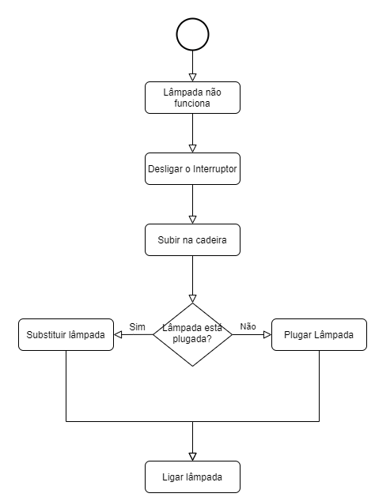

# Algoritmos :bulb:

O inicio pra desenvolver a lógica (inclusive a de programação) é entender o que são os algoritmos e como eles se aplicam na resolução de problemas.

## Definição

De acordo com o dicionário, um algoritmo é:

> **Conjunto das regras e procedimentos lógicos perfeitamente definidos que levam à solução de um problema em um número  finito de etapas.**

Ou, de um jeito mais simples:

> **Um algoritmo é uma sequência de passos finitos e bem definidos para que alguma tarefa seja executada.**

Ao cozinhar, por exemplo, seguimos uma receita que pode ser considerada um algoritmo uma vez que ela define o passo a passo para que no final tenhamos alimento desejado.

## Exemplo de algoritmo e suas representações

Imagine que a sua lâmpada parou de funcionar e você tem que consertar, qual seria o algoritmo pra que essa tarefa fosse executada?

Pode-se representar o algoritmo de duas formas:

### Script

- Desligar o interruptor
- Subir em uma cadeira
- Verificar se a lâmpada só estava mal encaixada (com mal contato)
  - Se tem mal contato então rosqueie a lâmpada  no soquete.
  - Se não tem mal contato então substituir por uma nova.
- Ligar a lâmpada.

### Fluxograma

